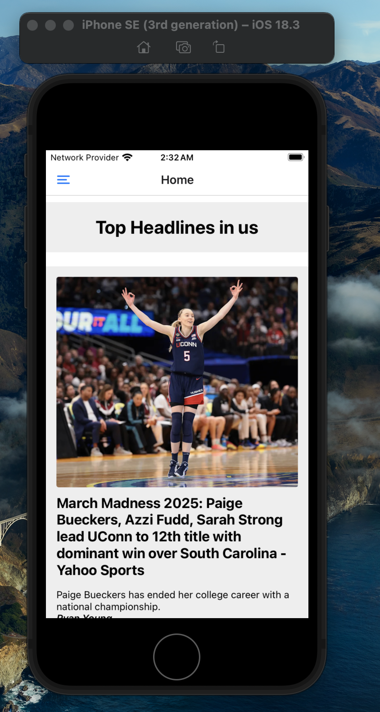

# 📰 News Room App

Welcome to the **News Room** app!  
This app provides a clean UI for browsing news items. Below are screenshots showcasing key parts of the app.

---

## 🏠 Home Screen



---

## 🧭 Navigation Menu


---

## 📰 News Item One


---

## 📰 News Item Two


---

### 📂 Location

This README is inside the `news-room` directory.  
To view it:

```bash
cd news-room
cat README.md
